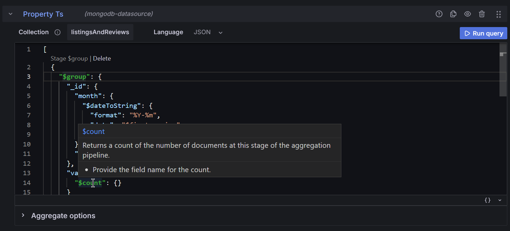
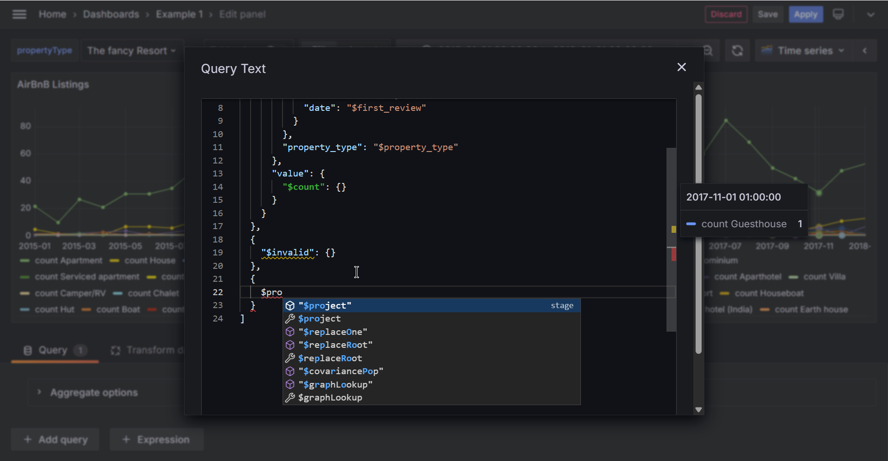

# Grafana MongoDB Data Source

A free, open source plugin to integrate MongoDB on Grafana, an alternative to Grafana Lab's MongoDB enterprise plugin and MongoDB Atlas Charts.

Visit the [documents](https://haohanyang.github.io/mongodb-datasource/) to get started.