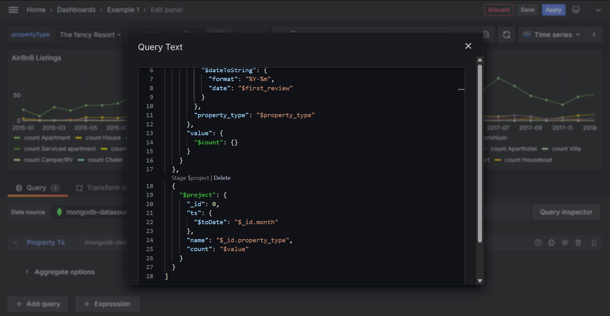

# Code Editor

Here we show the core code editor component used in the plugin, which has auto-completion, operator documentation preview on hovering, validation, syntax highlighting and more, crafted for MongoDB aggregation language.

In addition to core editor, the plugin also supports code formatting, and editing in dedicated modal windows.

!!! info
JavaScript query is parsed and converted to JSON by [mongodb-query-parser](https://www.npmjs.com/package/mongodb-query-parser), which supports a small subset of JavaScript evaluation. Click "Parse filter" to see the resulting JSON query.

=== "JavaScript"
    

=== "JSON"
    

