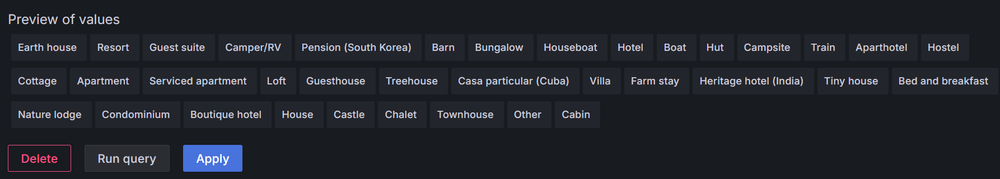
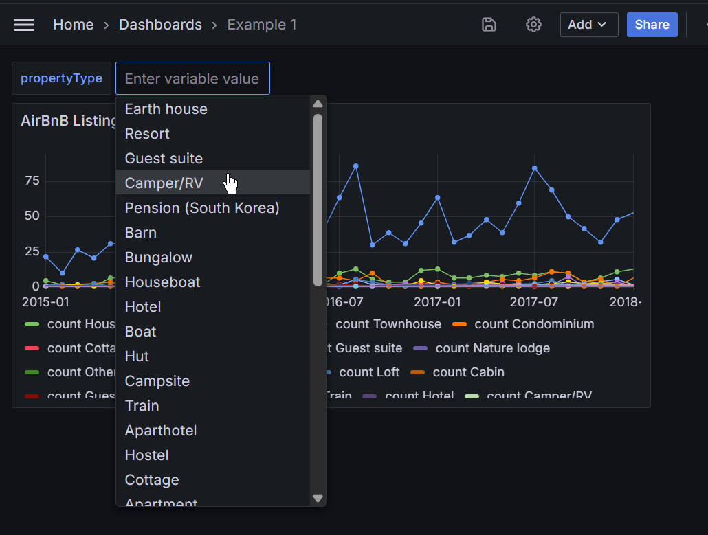
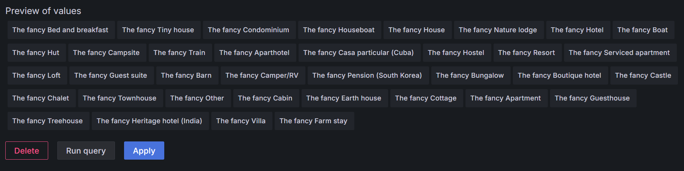
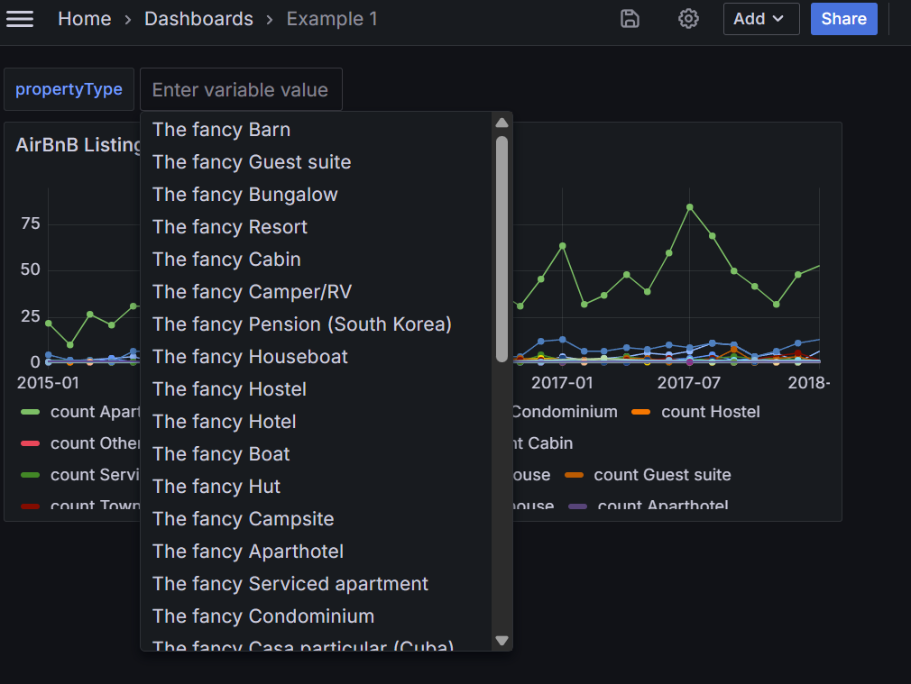

# Query Variables

## Variable Value

The plugin supports variables fetched from the query result. Assume we want to define a variable `propertyType` from [Sample AirBnB Listings Dataset](https://www.mongodb.com/docs/atlas/sample-data/sample-airbnb/). User can select one of the property types (Apartment, Hotel, etc) in the dashboard. We can create such variable with following query. Note that `value` field is required in the result.

```json
[
  {
    "$group": {
      "_id": "$property_type"
    }
  },
  {
    "$project": {
      "value": "$_id"
    }
  }
]
```

Click "Run query", and see the query result.



Save the variable, and you can see the variable in the dashboard.



## Display Text

You can customize the variable's display text by `text` field.

```json
[
  {
    "$group": {
      "_id": "$property_type"
    }
  },
  {
    "$project": {
      "value": "$_id",
      "text": {
        "$concat": ["The fancy ", "$_id"]
      }
    }
  }
]
```



