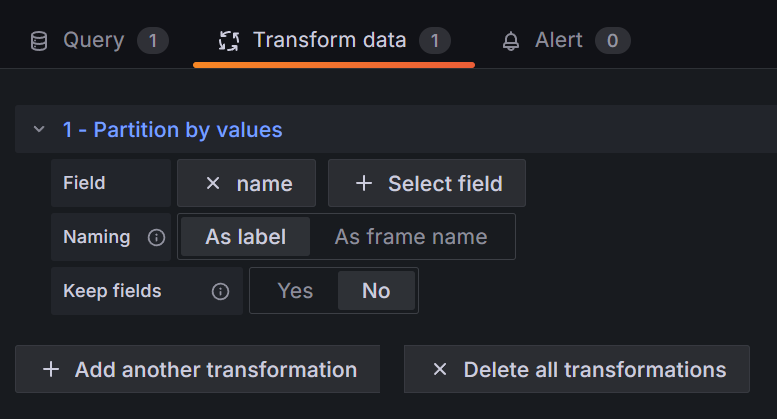
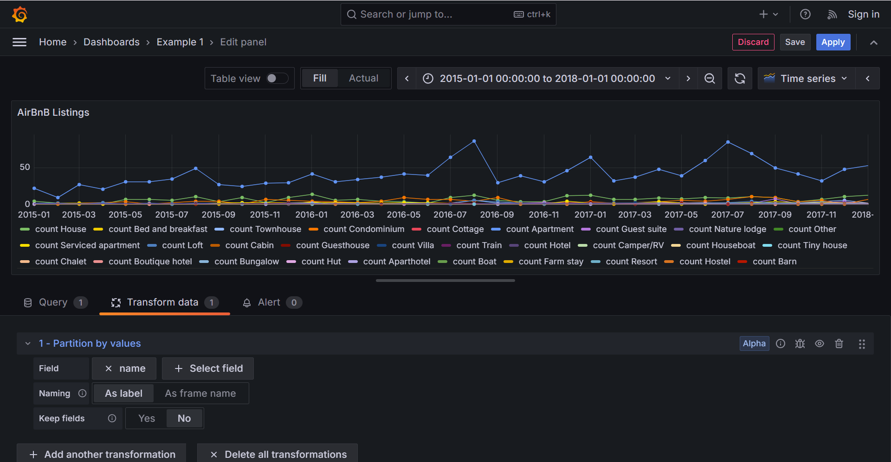

# Query

!!! example

    The examples on this page use the [Sample AirBnB Listings Dataset](https://www.mongodb.com/docs/atlas/sample-data/sample-airbnb/). You can download the raw data from [listingsAndReviews.json](https://github.com/neelabalan/mongodb-sample-dataset/blob/main/sample_airbnb/listingsAndReviews.json).

## Query Language

Write queries as a MongoDB aggregation pipeline — an array of pipeline stages — directly in the Query Editor. Both JSON and JavaScript object syntax are supported.

### JSON

Standard JSON syntax. All keys and string values must be quoted.

```json
[
  {
    "$match": {
      "property_type": "Apartment"
    }
  },
  {
    "$limit": 10
  },
  {
    "$project": {
      "name": 1,
      "listing_url": 1
    }
  }
]
```

### JavaScript

JavaScript object syntax allows unquoted keys and supports inline expressions, which can be useful for dynamic or computed values.

```js
[
  {
    $match: {
      property_type: 'Apartmen' + 't',
    },
  },
  {
    $limit: 2 + 4,
  },
  {
    $project: {
      name: 1,
      listing_url: 1,
    },
  },
];
```

!!! warning

    JavaScript expression support is partial, provided by [mongodb-query-parser](https://www.npmjs.com/package/mongodb-query-parser). Complex expressions may not evaluate as expected.

---

## Common Query Patterns

### Filter by Dashboard Time Range

Use the built-in variables `$__from` and `$__to` to filter documents within the dashboard's selected time range. Both variables represent Unix timestamps in milliseconds.

```json
[
  {
    "$match": {
      "last_scraped": {
        "$gt": { "$date": { "$numberLong": "$__from" } },
        "$lt": { "$date": { "$numberLong": "$__to" } }
      }
    }
  },
  {
    "$project": {
      "name": 1,
      "listing_url": 1,
      "description": 1
    }
  },
  {
    "$limit": 10
  }
]
```

### Count Documents Over Time

Group documents by a date field and count each bucket. This is the foundation for visualizing time series data in Grafana.

The example below groups listings by the month of their `first_review` date:

```json
[
  {
    "$group": {
      "_id": {
        "$dateToString": { "format": "%Y-%m", "date": "$first_review" }
      },
      "count": { "$count": {} }
    }
  },
  {
    "$project": {
      "_id": 0,
      "ts": { "$toDate": "$_id" },
      "count": 1
    }
  }
]
```

Adjust the `format` string to control the granularity of your time buckets:

| Granularity | Format String |
| ----------- | ------------- |
| Year        | `%Y`          |
| Month       | `%Y-%m`       |
| Day         | `%Y-%m-%d`    |
| Hour        | `%Y-%m-%dT%H` |

### Break Down by Category

To plot multiple categories (e.g. one line per property type) on the same time series chart, include the category field in the group key alongside the date.

```json
[
  {
    "$group": {
      "_id": {
        "month": {
          "$dateToString": { "format": "%Y-%m", "date": "$first_review" }
        },
        "property_type": "$property_type"
      },
      "value": { "$count": {} }
    }
  },
  {
    "$project": {
      "_id": 0,
      "ts": { "$toDate": "$_id.month" },
      "name": "$_id.property_type",
      "count": "$value"
    }
  }
]
```

Because the plugin returns a single data frame, you need to split it by category using Grafana's built-in transformation:

1. Open the **Transform** tab in your panel editor.
2. Add the **"Partition by values"** transformation.
3. Set the field to **`name`**.



Each category will now appear as a separate series on your visualization.



!!! info

    Prior to v0.5, the plugin handled category partitioning automatically when the "time series" query type was selected. This was removed in v0.5 in favor of using Grafana's native Data Transformations, which offer greater flexibility.
